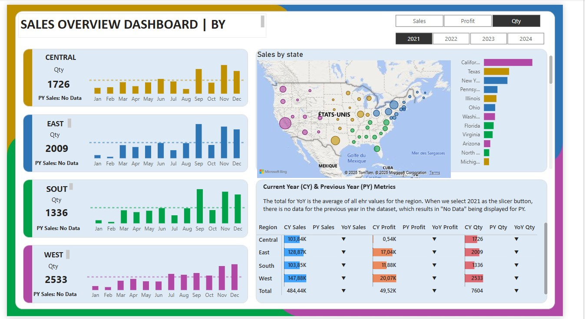

# 📊 Power BI – Sales Overview Dashboard

Este proyecto presenta un dashboard interactivo de ventas regionales creado con Power BI. Incluye KPIs dinámicos, visualizaciones comparativas entre años (YoY) y un mapa por estado.

## 🧰 Herramientas utilizadas
- Power BI Desktop
- DAX (medidas y lógica condicional)
- Parámetros de campo y segmentadores
- Visualizaciones: gráficos de barras, líneas, tarjetas y mapa geográfico

## 🔎 Funcionalidades principales
- Selección dinámica entre métricas: Ventas, Utilidad, Cantidad
- Comparación Año Actual (CY) vs Año Anterior (PY)
- KPI por región (CENTRAL, EAST, SOUTH, WEST)
- Visualización por mes y por estado
- Mapa interactivo de ventas por ubicación

## 📁 Archivos
- `PBI_Sales.pbix` – archivo Power BI del dashboard
- `Sales Overview Data.xlsx` – dataset base utilizado
- `image_dashboard.jpg` – captura del dashboard

## 📸 Vista previa

## 📝 Notas
Este proyecto fue desarrollado como parte de mi formación en análisis de datos. Los datos son ficticios y utilizados únicamente con fines educativos.
